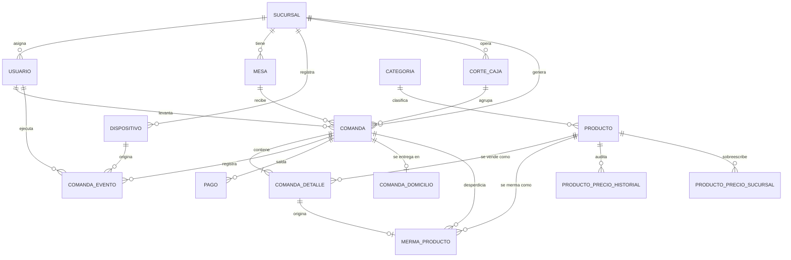
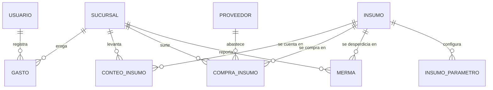

# 04. Modelo de Datos

**Proyecto:** Leña — Sistema de comandas y gestión de restaurantes pequeños
**Versión del documento:** 1.1
**Fecha:** 2026-07-16
**Autor:** Carlos González Laines
**Depende de:** [02. Arquitectura](./2.-Arquitectura.md), [03. Requisitos funcionales](./3.-Requisitos%20funcionales.md)

## Registro de cambios

| Versión | Fecha | Autor | Cambio |
|---|---|---|---|
| 1.0 | 2026-07-15 | Carlos González Laines | Modelo inicial: MVP + tablas Fase 2 |
| 1.1 | 2026-07-16 | Carlos González Laines | Ajustes al implementar fases 2–4: check `enviada_tiene_fecha` corregido (migración 0003) para permitir línea cancelada en borrador; tablas `sesion` e `intento_auth` y `dispositivo.token_hash` (fase 3, §3.2); nota de cómo `comanda_domicilio` se materializa desde el evento `comanda_creada` (§4.1) |
| 1.2 | 2026-07-16 | Carlos González Laines | Rol `superadmin` en `rol_usuario`; el administrador pasa a ser por-sucursal. Constraints `admin_sin_sucursal`/`admin_usa_email` → `rol_scope`/`rol_credencial` (migración 0006, recrea el enum porque `ALTER TYPE ADD VALUE` no puede usarse en la misma transacción del migrador). |
| 1.3 | 2026-07-17 | Carlos González Laines | `sucursal.clave` (única, NOT NULL): la escribe el mesero/cocina para entrar; se genera al dar de alta la sucursal (migración 0007). |

---

## 1. Principios del modelo

Cinco reglas de las que se deriva todo lo demás. Si algo en este documento parece raro, la razón está aquí.

| # | Principio | Origen |
|---|---|---|
| P1 | **El log de eventos es la verdad.** `comanda.estado` y `comanda.total` son proyecciones cacheadas, siempre recomputables desde `comanda_evento`. | ADR-002 |
| P2 | **Las llaves primarias son UUIDv7 generadas en el cliente.** Ninguna escritura necesita al servidor para existir. | ADR-003 |
| P3 | **El dinero histórico es inmutable.** Las líneas guardan snapshot de precio y nombre. | ADR-006 |
| P4 | **Nada se borra físicamente.** Baja lógica en todo lo referenciable por historial. | ADR-006, RF-B-3, RF-C-3, RF-D-5 |
| P5 | **Las tablas de Fase 2 existen desde hoy.** Ese motor necesita historial y el historial se acumula desde el día 1. | ADR §7, RF-M-* |

**Convenciones:** `id uuid` PK en todas las tablas · `created_at timestamptz not null default now()` en todas · dinero en `numeric(10,2)`, **jamás** `float` · cantidades de insumo en `numeric(12,3)` (kilos y litros tienen fracciones; los tacos no) · nombres de tabla en singular.

---

## 2. Diagrama entidad-relación

### 2.1 Núcleo operativo (MVP)



### 2.2 Finanzas e insumos (MVP parcial + Fase 2)



**No hay tabla `receta` ni `producto_insumo`, y es deliberado.** El negocio no opera con escandallos. La relación producto↔insumo se *aprende* de los datos (§8), no se captura. Modelarla obligaría al gerente a mantener recetas que no usa.

---

## 3. Catálogo y organización

```sql
CREATE TABLE sucursal (
  id          uuid PRIMARY KEY,
  nombre      text NOT NULL,
  clave       text NOT NULL UNIQUE,            -- la escribe el mesero para entrar (RF-B)
  direccion   text,
  activo      boolean NOT NULL DEFAULT true,   -- P4
  created_at  timestamptz NOT NULL DEFAULT now(),
  updated_at  timestamptz NOT NULL DEFAULT now()
);

CREATE TYPE rol_usuario AS ENUM ('superadmin', 'administrador', 'cocina', 'mesero');

CREATE TABLE usuario (
  id             uuid PRIMARY KEY,
  sucursal_id    uuid REFERENCES sucursal(id),   -- NULL solo para superadmin, alcance global (RF-C-4)
  nombre         text NOT NULL,
  rol            rol_usuario NOT NULL,
  email          text UNIQUE,                    -- superadmin y administrador (RF-A-1)
  password_hash  text,                           -- Argon2id, superadmin y administrador
  pin_hash       text,                           -- Argon2id, mesero y cocina (RF-A-2)
  activo         boolean NOT NULL DEFAULT true,
  created_at     timestamptz NOT NULL DEFAULT now(),
  updated_at     timestamptz NOT NULL DEFAULT now(),

  -- superadmin es el único global; administrador/cocina/mesero van a una sucursal.
  CONSTRAINT rol_scope
    CHECK ((rol = 'superadmin' AND sucursal_id IS NULL)
        OR (rol <> 'superadmin' AND sucursal_id IS NOT NULL)),
  -- superadmin/administrador entran con email+contraseña; cocina/mesero con PIN.
  CONSTRAINT rol_credencial
    CHECK ((rol IN ('superadmin', 'administrador') AND email IS NOT NULL AND password_hash IS NOT NULL)
        OR (rol IN ('cocina', 'mesero') AND pin_hash IS NOT NULL))
);

CREATE TABLE dispositivo (
  id             uuid PRIMARY KEY,
  sucursal_id    uuid NOT NULL REFERENCES sucursal(id),
  nombre         text NOT NULL,                   -- "Tablet Mesero 1"
  letra          text NOT NULL,                   -- "A" → identificador local A-7 (09 §4.2)
  token_hash     text,                            -- credencial del dispositivo (Argon2id, RS-A-3, fase 3)
  activo         boolean NOT NULL DEFAULT true,
  ultimo_seq     bigint NOT NULL DEFAULT 0,       -- diagnóstico; el cursor real vive en el cliente
  ultima_sync_at timestamptz,
  created_at     timestamptz NOT NULL DEFAULT now(),
  UNIQUE (sucursal_id, letra)
);

CREATE TABLE mesa (
  id          uuid PRIMARY KEY,
  sucursal_id uuid NOT NULL REFERENCES sucursal(id),
  nombre      text NOT NULL,                      -- "Mesa 4", "Barra 2"
  activo      boolean NOT NULL DEFAULT true,
  created_at  timestamptz NOT NULL DEFAULT now(),
  UNIQUE (sucursal_id, nombre)
);

CREATE TABLE categoria (
  id          uuid PRIMARY KEY,
  nombre      text NOT NULL,
  orden       integer NOT NULL DEFAULT 0,         -- orden de despliegue en la UI (RF-D-6)
  activo      boolean NOT NULL DEFAULT true,
  created_at  timestamptz NOT NULL DEFAULT now()
);
```

**El PIN único por sucursal (RF-A-3)** se garantiza en la aplicación, no con un índice: el hash Argon2id es distinto por sal aunque el PIN sea el mismo, así que un `UNIQUE` sobre `pin_hash` no serviría de nada. Al asignar un PIN, el servidor lo verifica contra los usuarios activos de esa sucursal.

**`dispositivo.letra` resuelve el problema del "para llevar"** (`09` §4.2). Al cliente de mostrador hay que vocearle algo, pero el folio lo asigna el servidor al sincronizar (RF-E-13) y sin red no hay folio que gritar. Cada dispositivo tiene una letra —única en su sucursal— y genera identificadores locales `A-1`, `A-2`, `B-1`… Nunca colisionan, funcionan sin red y se gritan fácil.

Son **dos identificadores con dos públicos**: `A-7` es para la persona y `#43` para la contabilidad. El cliente jamás ve el folio.

**`dispositivo.token_hash` (añadido en fase 3).** El PIN autentica a la persona; el token del dispositivo autentica al lugar (RS-A-3). El admin registra el dispositivo y el servidor devuelve el token en claro **una sola vez**; después solo vive su hash (SHA-256, no Argon2: el token es de alta entropía). Un PIN válido no sirve desde un dispositivo no registrado. Revocar el dispositivo (`activo = false`) le quita acceso al reconectar, pero **conserva su outbox** para sincronizar antes de borrar (RS-A-9, RS-L-5).

### 3.1 Productos

```sql
CREATE TABLE producto (
  id           uuid PRIMARY KEY,
  categoria_id uuid NOT NULL REFERENCES categoria(id),
  nombre       text NOT NULL,
  descripcion  text,
  precio_base  numeric(10,2) NOT NULL CHECK (precio_base >= 0),
  disponible   boolean NOT NULL DEFAULT true,   -- temporal: "se acabó" (RF-D-7)
  activo       boolean NOT NULL DEFAULT true,   -- permanente: baja lógica (RF-D-5)
  created_at   timestamptz NOT NULL DEFAULT now(),
  updated_at   timestamptz NOT NULL DEFAULT now()
);

-- Auditoría de cambios de precio (RF-D-4). Append-only.
CREATE TABLE producto_precio_historial (
  id              uuid PRIMARY KEY,
  producto_id     uuid NOT NULL REFERENCES producto(id),
  precio_anterior numeric(10,2) NOT NULL,
  precio_nuevo    numeric(10,2) NOT NULL,
  actor_id        uuid NOT NULL REFERENCES usuario(id),
  created_at      timestamptz NOT NULL DEFAULT now()
);

-- Precio por sucursal (RF-D-8, prioridad C).
CREATE TABLE producto_precio_sucursal (
  producto_id uuid NOT NULL REFERENCES producto(id),
  sucursal_id uuid NOT NULL REFERENCES sucursal(id),
  precio      numeric(10,2) NOT NULL CHECK (precio >= 0),
  updated_at  timestamptz NOT NULL DEFAULT now(),
  PRIMARY KEY (producto_id, sucursal_id)
);
```

**`disponible` y `activo` son campos distintos a propósito (RF-D-5 vs RF-D-7).** "Se acabó la carne hoy" y "ya no vendemos este plato" son decisiones de personas distintas, con vigencias distintas. Fusionarlas obliga al gerente a recrear productos cada semana.

**`producto_precio_historial` es auditoría, no la fuente del precio.** El precio vigente vive en `producto.precio_base`; el histórico existe para responder "¿quién subió esto y cuándo?". La correctitud de los tickets viejos **no** depende de esta tabla — depende del snapshot en la línea (§4.2). Esto es intencional: una tabla de auditoría corrupta no debe poder alterar el dinero histórico.

### 3.2 Autenticación (fase 3)

Dos tablas que no existían en el modelo 1.0; se agregaron al implementar la fase 3 (`07. Requisitos de seguridad` §3).

```sql
-- Sesión con refresh rotatorio (RS-A-7, RS-A-12).
CREATE TABLE sesion (
  id            uuid PRIMARY KEY DEFAULT gen_random_uuid(),
  usuario_id    uuid NOT NULL REFERENCES usuario(id),
  dispositivo_id uuid REFERENCES dispositivo(id),  -- NULL para el admin central
  refresh_hash  text NOT NULL,                     -- SHA-256 del token opaco
  familia       uuid NOT NULL DEFAULT gen_random_uuid(),
  expira_at     timestamptz NOT NULL,
  revocada_at   timestamptz,
  created_at    timestamptz NOT NULL DEFAULT now()
);
CREATE INDEX sesion_refresh_idx ON sesion (refresh_hash);
CREATE INDEX sesion_familia_idx ON sesion (familia);

-- Bitácora de intentos de autenticación (RS-A-10). Append-only para lena_app.
CREATE TABLE intento_auth (
  id            uuid PRIMARY KEY DEFAULT gen_random_uuid(),
  usuario_id    uuid REFERENCES usuario(id),
  dispositivo_id uuid REFERENCES dispositivo(id),
  exito         boolean NOT NULL,
  ip            text,
  motivo        text,
  created_at    timestamptz NOT NULL DEFAULT now()
);
CREATE INDEX intento_auth_disp_idx ON intento_auth (dispositivo_id, created_at);
```

**El refresh rota y detecta el reuso.** Cada refresh emite una fila nueva y revoca la anterior; `familia` encadena las rotaciones de un mismo login. Si llega un refresh **ya revocado** de una familia, es señal de robo de token: se revoca la familia entera (el ladrón y la víctima quedan fuera, y la víctima vuelve a entrar).

**`intento_auth` es de dónde sale el bloqueo (RS-A-4)**, no una tabla de estado aparte: se cuentan los fallos desde el último éxito del dispositivo. Es append-only (la migración revoca `UPDATE/DELETE` a `lena_app`) por la misma razón que el log de eventos: una bitácora de seguridad que se puede editar no es una bitácora.

---

## 4. Comandas

### 4.1 Cabecera

```sql
CREATE TYPE tipo_servicio  AS ENUM ('mesa', 'para_llevar', 'domicilio');
CREATE TYPE estado_comanda AS ENUM (
  'borrador',      -- se está capturando, cocina no la ve
  'enviada',       -- cocina la recibió
  'en_preparacion',
  'lista',
  'entregada',
  'cobrada',       -- terminal
  'cancelada'      -- terminal
);

CREATE TABLE comanda (
  id             uuid PRIMARY KEY,                  -- UUIDv7 del cliente (P2)
  sucursal_id    uuid NOT NULL REFERENCES sucursal(id),
  corte_caja_id  uuid NOT NULL REFERENCES corte_caja(id),  -- RF-H-2
  mesa_id        uuid REFERENCES mesa(id),          -- NULL si para_llevar
  tipo_servicio  tipo_servicio NOT NULL,
  mesero_id      uuid NOT NULL REFERENCES usuario(id),
  folio          integer,                           -- NULL hasta sincronizar (RF-E-13)

  -- Proyecciones cacheadas. Verdad = comanda_evento (P1).
  estado         estado_comanda NOT NULL DEFAULT 'borrador',
  total          numeric(10,2) NOT NULL DEFAULT 0,

  motivo_cancelacion text,
  abierta_at     timestamptz NOT NULL,
  cerrada_at     timestamptz,
  created_at     timestamptz NOT NULL DEFAULT now(),

  CONSTRAINT mesa_solo_si_es_en_mesa
    CHECK ((tipo_servicio = 'mesa' AND mesa_id IS NOT NULL)
        OR (tipo_servicio <> 'mesa' AND mesa_id IS NULL)),
  CONSTRAINT cancelada_con_motivo
    CHECK (estado <> 'cancelada' OR motivo_cancelacion IS NOT NULL)
);

-- Datos del cliente para entrega a domicilio (RF-E-17). 1:1 opcional con comanda.
CREATE TABLE comanda_domicilio (
  comanda_id     uuid PRIMARY KEY REFERENCES comanda(id),
  nombre_cliente text NOT NULL,
  telefono       text NOT NULL,
  direccion      text NOT NULL,
  referencias    text,              -- "portón verde, frente a la tienda"
  created_at     timestamptz NOT NULL DEFAULT now()
);

CREATE INDEX comanda_domicilio_tel_idx ON comanda_domicilio (telefono);

-- Folio secuencial por sucursal, asignado en servidor. Parcial: tolera NULLs offline.
CREATE UNIQUE INDEX comanda_folio_uq
  ON comanda (sucursal_id, folio) WHERE folio IS NOT NULL;

CREATE INDEX comanda_abiertas_idx
  ON comanda (sucursal_id, estado) WHERE estado NOT IN ('cobrada', 'cancelada');
CREATE INDEX comanda_corte_idx ON comanda (corte_caja_id);
```

**El índice parcial de folio es la pieza que hace funcionar el offline.** Un `UNIQUE (sucursal_id, folio)` normal trataría cada `NULL` como distinto en Postgres, así que técnicamente funcionaría — pero el índice parcial expresa la intención y evita indexar filas que aún no tienen folio. Dos meseros offline no pueden coordinar una secuencia sin colisionar; por eso el folio lo asigna el servidor al sincronizar y la comanda vive sin él mientras tanto (ADR-003).

**`corte_caja_id` es `NOT NULL`, y eso implementa RF-H-3.** No se puede crear una comanda sin turno abierto porque el esquema no lo permite. Es una regla de negocio expresada como restricción, no como validación olvidable.

**`comanda_domicilio` se llena desde el log, no desde una escritura directa.** Los datos del cliente viajan en el payload del evento `comanda_creada` (`domicilio: { nombre_cliente, telefono, direccion, referencias? }`) y el servidor materializa esta tabla al procesar el push, junto con la cabecera. Así el domicilio también funciona offline: se captura, se encola y se sincroniza como cualquier otro evento. Como es dato personal (LFPDPPP), el payload lleva solo el mínimo para entregar (RS-P-1).

### 4.2 Líneas — aquí vive la inmutabilidad del dinero

```sql
CREATE TYPE estado_linea AS ENUM (
  'borrador',        -- capturada; cocina NO la ve
  'pendiente',       -- enviada a cocina → SE ESTÁ HACIENDO
  'en_preparacion',  -- reservado; sin uso en el MVP (ver nota)
  'lista',
  'cancelada'
);

CREATE TABLE comanda_detalle (
  id              uuid PRIMARY KEY,
  comanda_id      uuid NOT NULL REFERENCES comanda(id),
  producto_id     uuid NOT NULL REFERENCES producto(id),  -- trazabilidad, NO fuente de precio

  -- SNAPSHOT AL MOMENTO DE LA VENTA (P3 / ADR-006 / RF-E-10)
  nombre_producto text NOT NULL,
  precio_unitario numeric(10,2) NOT NULL CHECK (precio_unitario >= 0),

  cantidad        integer NOT NULL CHECK (cantidad > 0),
  notas           text,                                   -- "sin cebolla" (RF-E-3)
  estado          estado_linea NOT NULL DEFAULT 'borrador',
  enviada_at      timestamptz,                            -- cuándo dejó de ser borrador (RF-E-7)
  lista_at        timestamptz,                            -- métrica de tiempo de cocina
  created_at      timestamptz NOT NULL DEFAULT now(),

  -- Corregido en migración 0003 (fase 2): la versión original exigía
  -- enviada_at para TODO estado <> borrador, pero una línea puede cancelarse
  -- ESTANDO en borrador (o nacer cancelada porque la comanda ya cerró, 05 §5),
  -- y esa línea nunca cruzó a cocina → enviada_at NULL es correcto.
  CONSTRAINT enviada_tiene_fecha
    CHECK ((estado = 'borrador' AND enviada_at IS NULL)
        OR (estado IN ('pendiente','en_preparacion','lista') AND enviada_at IS NOT NULL)
        OR (estado = 'cancelada'))
);

CREATE INDEX comanda_detalle_comanda_idx ON comanda_detalle (comanda_id);
CREATE INDEX comanda_detalle_producto_idx ON comanda_detalle (producto_id);
```

**`nombre_producto` y `precio_unitario` son copias, no lecturas.** El `producto_id` está solo para reportes y para saber qué se vendió. El total se calcula `SUM(cantidad * precio_unitario)` **de esta tabla**, jamás con un `JOIN` a `producto`. Si mañana el admin sube el taco de $18 a $20 (RF-D-3), esta fila sigue diciendo $18 y el ticket de hoy sigue siendo verdad.

Ese `JOIN` a `producto` para obtener el precio es exactamente el bug que ADR-006 previene, y es tentador porque "normaliza". No lo hagas: el precio de una venta **no es** un atributo del producto, es un hecho del pasado.

**El estado de la línea es el estado fundamental del sistema; el de la comanda se deriva de él** (ver `05. Casos de uso y diagramas de estado` §4). Esto es lo que hace funcionar RF-E-7 sin código especial: si a una comanda `lista` se le agrega una línea en `borrador` y se envía, la comanda vuelve sola a `enviada` y cocina la ve otra vez. El caso "la mesa pidió más tacos" — que en una taquería pasa todo el tiempo — sale gratis.

Con un `comanda.estado` independiente, esa comanda seguiría diciendo `lista` y los tacos nuevos nunca llegarían a cocina. Es el bug que esta decisión previene.

**`estado` por línea existe desde hoy aunque la UI del MVP opere por comanda (RF-F-6).** Habilitarlo después es cambio de interfaz, no migración de datos.

### 4.3 El log de eventos — la fuente de verdad

```sql
CREATE TYPE tipo_evento AS ENUM (
  'comanda_creada',
  'linea_agregada',
  'linea_modificada',
  'linea_eliminada',
  'comanda_enviada',
  'preparacion_iniciada',
  'linea_lista',
  'comanda_lista',
  'comanda_entregada',
  'pago_registrado',
  'comanda_cobrada',
  'comanda_cancelada',
  'linea_cancelada',
  'comanda_reabierta'
);

CREATE TABLE comanda_evento (
  id            uuid PRIMARY KEY,                  -- UUIDv7 del cliente → idempotencia (P2)
  seq           bigserial NOT NULL,                -- monótono del servidor → cursor de pull
  comanda_id    uuid NOT NULL REFERENCES comanda(id),
  detalle_id    uuid REFERENCES comanda_detalle(id),
  sucursal_id   uuid NOT NULL REFERENCES sucursal(id),  -- desnormalizado: filtra el pull sin JOIN
  tipo          tipo_evento NOT NULL,
  payload       jsonb NOT NULL DEFAULT '{}',
  actor_id      uuid NOT NULL REFERENCES usuario(id),
  dispositivo_id uuid NOT NULL REFERENCES dispositivo(id),
  hlc           text NOT NULL,                     -- orden causal (ADR-003)
  ts_cliente    timestamptz NOT NULL,              -- informativo; NO confiable
  ts_servidor   timestamptz NOT NULL DEFAULT now(),
  created_at    timestamptz NOT NULL DEFAULT now()
);

CREATE INDEX comanda_evento_seq_idx      ON comanda_evento (sucursal_id, seq);
CREATE INDEX comanda_evento_comanda_idx  ON comanda_evento (comanda_id, hlc);
```

Esta tabla es **append-only**. No hay `UPDATE`, no hay `DELETE`, y se revoca a nivel de permisos (ver `07. Requisitos de seguridad`). Satisface RF-E-16 y la trazabilidad de Visión §2 sin esfuerzo adicional.

**Los dos relojes conviven porque resuelven cosas distintas:**

| Campo | Para qué | Por qué no el otro |
|---|---|---|
| `hlc` | Ordenar eventos entre dispositivos | El `seq` no existe hasta que el evento llega al servidor |
| `seq` | Paginar el pull incremental | El HLC no es denso ni monótono global; sirve para ordenar, no para paginar |
| `ts_cliente` | Diagnóstico y UX | Las tablets tienen el reloj mal. Siempre. Jamás ordenar por esto |

**`sucursal_id` está desnormalizado a propósito.** El pull (`WHERE sucursal_id = ? AND seq > ?`) es la consulta más caliente del sistema y corre en cada reconexión. Meterle un `JOIN` a `comanda` para filtrar por sucursal es pagar el precio en el peor lugar posible.

**Idempotencia (RF-J-3):** la inserción es `INSERT ... ON CONFLICT (id) DO NOTHING`. Como el `id` lo genera el cliente, reenviar un lote tras un timeout no duplica nada. Es la propiedad que hace segura toda la sincronización.

### 4.4 Merma de producto — la comida que ya se hizo y nadie pagó

```sql
CREATE TABLE merma_producto (
  id           uuid PRIMARY KEY,
  sucursal_id  uuid NOT NULL REFERENCES sucursal(id),
  comanda_id   uuid NOT NULL REFERENCES comanda(id),
  detalle_id   uuid NOT NULL REFERENCES comanda_detalle(id),
  producto_id  uuid NOT NULL REFERENCES producto(id),

  -- Snapshot, mismo principio que comanda_detalle (P3)
  nombre_producto text NOT NULL,
  cantidad        integer NOT NULL CHECK (cantidad > 0),
  costo_estimado  numeric(10,2) NOT NULL,   -- cantidad × precio_unitario de la línea

  estado_al_cancelar estado_linea NOT NULL, -- 'pendiente', 'en_preparacion' o 'lista'
  motivo       text NOT NULL,               -- heredado de la cancelación
  actor_id     uuid NOT NULL REFERENCES usuario(id),
  fecha        date NOT NULL,
  created_at   timestamptz NOT NULL DEFAULT now(),

  CONSTRAINT solo_si_ya_estaba_en_cocina
    CHECK (estado_al_cancelar IN ('pendiente', 'en_preparacion', 'lista'))
);

CREATE INDEX merma_producto_periodo_idx ON merma_producto (sucursal_id, fecha);
CREATE INDEX merma_producto_prod_idx    ON merma_producto (producto_id, fecha);
```

**Esta tabla no es la misma que `merma` (§6), y la distinción es real:**

| | `merma_producto` (MVP) | `merma` (Fase 2) |
|---|---|---|
| Qué se desperdicia | Comida ya preparada — 3 tacos | Insumo crudo — 2 kg de carne |
| Unidad | Piezas de producto | kg, l, pza |
| Origen | Cancelación de una línea ya hecha | Caducidad, derrame, mal estado |
| Se detecta | Al instante, con culpable y comanda | Al conteo o a ojo |

Meterlas en una sola tabla obligaría a mezclar unidades incompatibles y a perder el vínculo con la comanda que la originó.

**El `CHECK solo_si_ya_estaba_en_cocina` codifica la regla del negocio:** la frontera de la merma es **el envío a cocina**. Una línea en `borrador` no ha existido para nadie; cancelarla no desperdicia nada. Una línea `pendiente` ya está en la plancha — en una taquería el pastor se corta al momento, en segundos, así que "enviada" y "haciéndose" son prácticamente lo mismo. La base rechaza el registro de una merma que no pudo existir.

**El estado `en_preparacion` queda reservado y sin uso en el MVP.** La interfaz de cocina tiene un solo botón (`✓ lista`) por decisión de simplicidad — ver `09. Diseño de interfaz`. Sin botón de "empezar", nadie produce ese estado. Se conserva en el enum porque agregarlo después sería una migración, y quitarlo hoy no ahorra nada.

**Hay una excepción y la determina quién cancela, no un campo aparte:**

| Quién cancela una línea ya enviada | ¿Merma? | Por qué |
|---|---|---|
| Mesero o Administrador | **Sí** | La comida se hizo y se va a tirar |
| **Cocinero** | **No** | Cocina cancela porque *no puede* prepararla (se acabó el insumo). Esa comida nunca existió |

**Quien sabe si la comida se hizo es el cocinero.** Por eso su cancelación es autoritativa: no hay que preguntarle a nadie ni capturar un campo extra. Cada actor aporta, al cancelar, el dato que solo él tiene. Ver `05. Casos de uso` §3 CU-06.

**En Fase 2 esta tabla alimenta al motor de compra.** El ratio aprendido de RF-M-1 convierte "3 tacos de pastor mermados" en "0.24 kg de carne consumidos sin venta". Así la merma por cancelación entra al pronóstico igual que una venta, y el gerente deja de comprar de menos por una pérdida que nadie contabilizaba.

---

## 5. Pagos y corte de caja

```sql
CREATE TYPE metodo_pago AS ENUM ('efectivo', 'tarjeta', 'transferencia');

CREATE TABLE pago (
  id          uuid PRIMARY KEY,
  comanda_id  uuid NOT NULL REFERENCES comanda(id),
  metodo      metodo_pago NOT NULL,
  monto       numeric(10,2) NOT NULL CHECK (monto > 0),
  recibido    numeric(10,2),          -- solo efectivo (RF-G-4)
  cambio      numeric(10,2),          -- solo efectivo, calculado
  referencia  text,                   -- tarjeta / transferencia (RF-G-5)
  actor_id    uuid NOT NULL REFERENCES usuario(id),
  created_at  timestamptz NOT NULL DEFAULT now(),

  CONSTRAINT efectivo_cuadra
    CHECK (metodo <> 'efectivo' OR (recibido IS NOT NULL AND recibido >= monto))
);

CREATE INDEX pago_comanda_idx ON pago (comanda_id);
```

**Varias filas por comanda = pago dividido (RF-G-3).** No hay `metodo_pago` en la cabecera de la comanda, y esa ausencia *es* el soporte de split payment. Modelarlo como campo único en `comanda` habría cerrado la puerta.

```sql
CREATE TYPE estado_corte AS ENUM ('abierto', 'cerrado');

CREATE TABLE corte_caja (
  id                uuid PRIMARY KEY,
  sucursal_id       uuid NOT NULL REFERENCES sucursal(id),
  estado            estado_corte NOT NULL DEFAULT 'abierto',
  fondo_inicial     numeric(10,2) NOT NULL CHECK (fondo_inicial >= 0),

  -- Se llenan al cerrar
  esperado_efectivo numeric(10,2),   -- derivado: fondo_inicial + SUM(pagos efectivo)
  contado_efectivo  numeric(10,2),   -- capturado a mano (RF-H-5)
  diferencia        numeric(10,2),   -- contado − esperado
  total_tarjeta     numeric(10,2),
  total_transferencia numeric(10,2),
  motivo_diferencia text,            -- obligatorio si supera umbral (RF-H-7)

  abierto_por  uuid NOT NULL REFERENCES usuario(id),
  abierto_at   timestamptz NOT NULL DEFAULT now(),
  cerrado_por  uuid REFERENCES usuario(id),
  cerrado_at   timestamptz,
  created_at   timestamptz NOT NULL DEFAULT now()
);

-- Un solo turno abierto por sucursal a la vez. Esto implementa RF-H-3 y RF-H-8.
CREATE UNIQUE INDEX corte_abierto_uq
  ON corte_caja (sucursal_id) WHERE estado = 'abierto';
```

**Ese índice parcial vale por media docena de validaciones.** Garantiza a nivel de base que no existan dos turnos abiertos simultáneos en una sucursal — condición que, de romperse, hace que las comandas se repartan entre turnos y ningún corte cuadre jamás. Una restricción que la aplicación no puede olvidar.

**`corte_caja` cerrado es inmutable (RF-H-10).** Corregir exige un ajuste registrado, no un `UPDATE`. Mismo principio que P1.

```sql
CREATE TYPE categoria_gasto AS ENUM ('insumo', 'servicio', 'sueldo', 'renta', 'otro');

CREATE TABLE gasto (
  id          uuid PRIMARY KEY,
  sucursal_id uuid NOT NULL REFERENCES sucursal(id),
  categoria   categoria_gasto NOT NULL,
  concepto    text NOT NULL,
  monto       numeric(10,2) NOT NULL CHECK (monto > 0),
  fecha       date NOT NULL,
  actor_id    uuid NOT NULL REFERENCES usuario(id),
  created_at  timestamptz NOT NULL DEFAULT now()
);

CREATE INDEX gasto_periodo_idx ON gasto (sucursal_id, fecha);
```

`fecha` es `date` y no `timestamptz` a propósito: un gasto pertenece a un día contable, no a un instante.

---

## 6. Fase 2 — Insumos

Tablas creadas en el MVP, sin UI hasta Fase 2 (P5).

```sql
CREATE TYPE unidad_medida AS ENUM ('kg', 'g', 'l', 'ml', 'pza', 'caja', 'manojo');

CREATE TABLE insumo (
  id       uuid PRIMARY KEY,
  nombre   text NOT NULL,
  unidad   unidad_medida NOT NULL,
  activo   boolean NOT NULL DEFAULT true,
  created_at timestamptz NOT NULL DEFAULT now()
);

CREATE TABLE proveedor (
  id       uuid PRIMARY KEY,
  nombre   text NOT NULL,
  contacto text,
  activo   boolean NOT NULL DEFAULT true,
  created_at timestamptz NOT NULL DEFAULT now()
);

CREATE TABLE insumo_parametro (
  insumo_id       uuid NOT NULL REFERENCES insumo(id),
  sucursal_id     uuid NOT NULL REFERENCES sucursal(id),
  stock_seguridad numeric(12,3) NOT NULL DEFAULT 0,   -- RF-M-4
  dias_entrega    integer NOT NULL DEFAULT 1,          -- RF-M-4
  PRIMARY KEY (insumo_id, sucursal_id)
);

CREATE TYPE tipo_conteo AS ENUM ('apertura', 'cierre');

-- El corazón del modelo: conteo diferencial, no recetas (RF-L-3, RF-L-4).
CREATE TABLE conteo_insumo (
  id          uuid PRIMARY KEY,
  sucursal_id uuid NOT NULL REFERENCES sucursal(id),
  insumo_id   uuid NOT NULL REFERENCES insumo(id),
  tipo        tipo_conteo NOT NULL,
  cantidad    numeric(12,3) NOT NULL CHECK (cantidad >= 0),
  fecha       date NOT NULL,
  actor_id    uuid NOT NULL REFERENCES usuario(id),
  created_at  timestamptz NOT NULL DEFAULT now(),
  UNIQUE (sucursal_id, insumo_id, tipo, fecha)   -- un conteo por tipo, insumo y día
);

CREATE TABLE compra_insumo (
  id           uuid PRIMARY KEY,
  sucursal_id  uuid NOT NULL REFERENCES sucursal(id),
  insumo_id    uuid NOT NULL REFERENCES insumo(id),
  proveedor_id uuid REFERENCES proveedor(id),
  cantidad     numeric(12,3) NOT NULL CHECK (cantidad > 0),
  costo_total  numeric(10,2) NOT NULL CHECK (costo_total >= 0),
  fecha        date NOT NULL,
  actor_id     uuid NOT NULL REFERENCES usuario(id),
  created_at   timestamptz NOT NULL DEFAULT now()
);

CREATE TABLE merma (
  id          uuid PRIMARY KEY,
  sucursal_id uuid NOT NULL REFERENCES sucursal(id),
  insumo_id   uuid NOT NULL REFERENCES insumo(id),
  cantidad    numeric(12,3) NOT NULL CHECK (cantidad > 0),
  motivo      text NOT NULL,        -- RF-L-6: sin motivo el dato no sirve para nada
  fecha       date NOT NULL,
  actor_id    uuid NOT NULL REFERENCES usuario(id),
  created_at  timestamptz NOT NULL DEFAULT now()
);

CREATE INDEX conteo_periodo_idx ON conteo_insumo (sucursal_id, insumo_id, fecha);
CREATE INDEX compra_periodo_idx ON compra_insumo (sucursal_id, insumo_id, fecha);
CREATE INDEX merma_periodo_idx  ON merma (sucursal_id, insumo_id, fecha);
```

El `UNIQUE (sucursal_id, insumo_id, tipo, fecha)` de `conteo_insumo` protege la fórmula: dos conteos de cierre del mismo insumo el mismo día harían que el consumo derivado sea ambiguo.

---

## 7. Vistas derivadas

```sql
-- Ventas granulares por día y producto.
-- Insumo de RF-I-2, RF-I-3, RF-I-6 y, sobre todo, del motor de Fase 2 (RF-M-1, RF-M-2).
CREATE VIEW venta_diaria_producto AS
SELECT
  c.sucursal_id,
  (c.cerrada_at AT TIME ZONE 'America/Mexico_City')::date AS fecha,
  EXTRACT(ISODOW FROM c.cerrada_at AT TIME ZONE 'America/Mexico_City')::int AS dia_semana,
  d.producto_id,
  d.nombre_producto,
  SUM(d.cantidad)                       AS unidades,
  SUM(d.cantidad * d.precio_unitario)   AS importe
FROM comanda c
JOIN comanda_detalle d ON d.comanda_id = c.id
WHERE c.estado = 'cobrada'
  AND d.estado <> 'cancelada'
GROUP BY 1, 2, 3, 4, 5;

-- Consumo derivado por conteo diferencial (RF-L-5).
--   consumo = conteo_apertura + compras − conteo_cierre
CREATE VIEW consumo_diario_insumo AS
SELECT
  a.sucursal_id,
  a.insumo_id,
  a.fecha,
  a.cantidad                                    AS apertura,
  COALESCE(cp.cantidad, 0)                      AS comprado,
  COALESCE(ci.cantidad, 0)                      AS cierre,
  a.cantidad + COALESCE(cp.cantidad, 0) - COALESCE(ci.cantidad, 0) AS consumo,
  COALESCE(m.cantidad, 0)                       AS merma_reportada
FROM conteo_insumo a
LEFT JOIN conteo_insumo ci
  ON ci.sucursal_id = a.sucursal_id AND ci.insumo_id = a.insumo_id
 AND ci.fecha = a.fecha AND ci.tipo = 'cierre'
LEFT JOIN LATERAL (
  SELECT SUM(cantidad) AS cantidad FROM compra_insumo x
  WHERE x.sucursal_id = a.sucursal_id AND x.insumo_id = a.insumo_id AND x.fecha = a.fecha
) cp ON true
LEFT JOIN LATERAL (
  SELECT SUM(cantidad) AS cantidad FROM merma x
  WHERE x.sucursal_id = a.sucursal_id AND x.insumo_id = a.insumo_id AND x.fecha = a.fecha
) m ON true
WHERE a.tipo = 'apertura';
```

**Nota de zona horaria, y no es menor:** el corte del día es a la medianoche local, no UTC. Un `::date` sobre un `timestamptz` sin convertir asigna las ventas de las 8 PM del sábado al domingo, y el pronóstico por día de semana de RF-M-2 queda inservible. La conversión a `America/Mexico_City` es obligatoria en toda agregación por día.

Ambas vistas empiezan como `VIEW`. Si el volumen lo pide (no antes — R5), pasan a `MATERIALIZED VIEW` con refresco nocturno. Es un cambio de una línea.

---

## 8. Cómo el modelo sostiene la recomendación de compra

Sin tabla `receta`, la relación producto↔insumo se deduce. Con `venta_diaria_producto` y `consumo_diario_insumo` alineadas por `(sucursal_id, fecha)`:

1. **Ratio implícito (RF-M-1).** Regresión lineal de `consumo_diario_insumo.consumo` contra las `unidades` de los productos vendidos ese día. El coeficiente que sale *es* la receta, aprendida de la realidad y no de lo que alguien cree que usa.
2. **Pronóstico (RF-M-2).** Media móvil de `unidades` agrupada por `dia_semana`. Un lunes y un sábado no se parecen; promediarlos juntos produce basura.
3. **Recomendación (RF-M-3).** `Σ(ratio × unidades_pronosticadas) × dias_entrega + stock_seguridad − stock_actual`.
4. **Confianza (RF-M-6).** Con menos de ~4 semanas por día de la semana, el sistema advierte en vez de recomendar. Una recomendación inventada sobre datos pobres quema la confianza del gerente de forma permanente.

**Todo esto es SQL más `regr_slope()` — que Postgres ya trae de fábrica. Cero ML.**

Y aquí está la razón por la que estas tablas existen desde el MVP (P5): el punto 2 necesita **semanas** de historial. Si las ventas granulares no se guardan desde el día 1, Fase 2 arranca sin datos y no puede recomendar nada durante meses.

Nótese también que el punto 1 depende de P3: si los precios históricos se reescribieran, el modelo aprendería de datos falsos. La inmutabilidad del dinero no es solo contable — es lo que hace confiable al motor.

---

## 9. Volumetría

Con ~200 comandas/día en 1 sucursal:

| Tabla | Filas/año | Nota |
|---|---|---|
| `comanda` | ~73,000 | |
| `comanda_detalle` | ~220,000 | ~3 líneas por comanda |
| `comanda_evento` | ~600,000 | ~8 eventos por comanda |
| `pago` | ~80,000 | |
| `venta_diaria_producto` | ~11,000 | vista |

Postgres ni se inmuta. **No hay que particionar nada** hasta pasar de decenas de millones de filas — años de operación con varias sucursales. Los índices de §4.3 bastan.

---

## 10. Deudas y decisiones abiertas

| # | Tema | Estado |
|---|---|---|
| D1 | Tipos de servicio | **Resuelto.** Tres: mesa numerada, para llevar (se bocea al cliente), domicilio (teléfono + dirección). Sin rol `Repartidor` — entrega quien esté libre |
| D2 | Propinas | Fuera de alcance. Entraría como tabla propia ligada a `pago`, sin tocar el total de la comanda |
| D3 | Precio por sucursal (RF-D-8) | Tabla creada, prioridad C. Con 1 sucursal no aporta nada hoy |
| D4 | Retención del log de eventos | Sin política. Revisar a los 2 años; hoy es un no-problema (§9) |
| D5 | Estado por línea (RF-F-6) | Esquema listo, UI del MVP opera por comanda |
