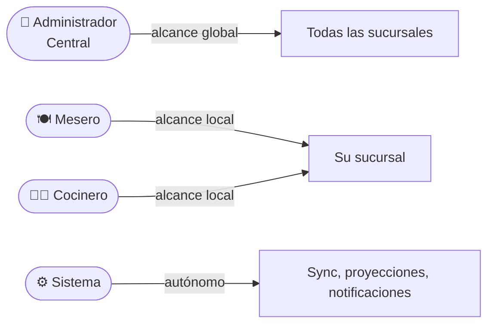
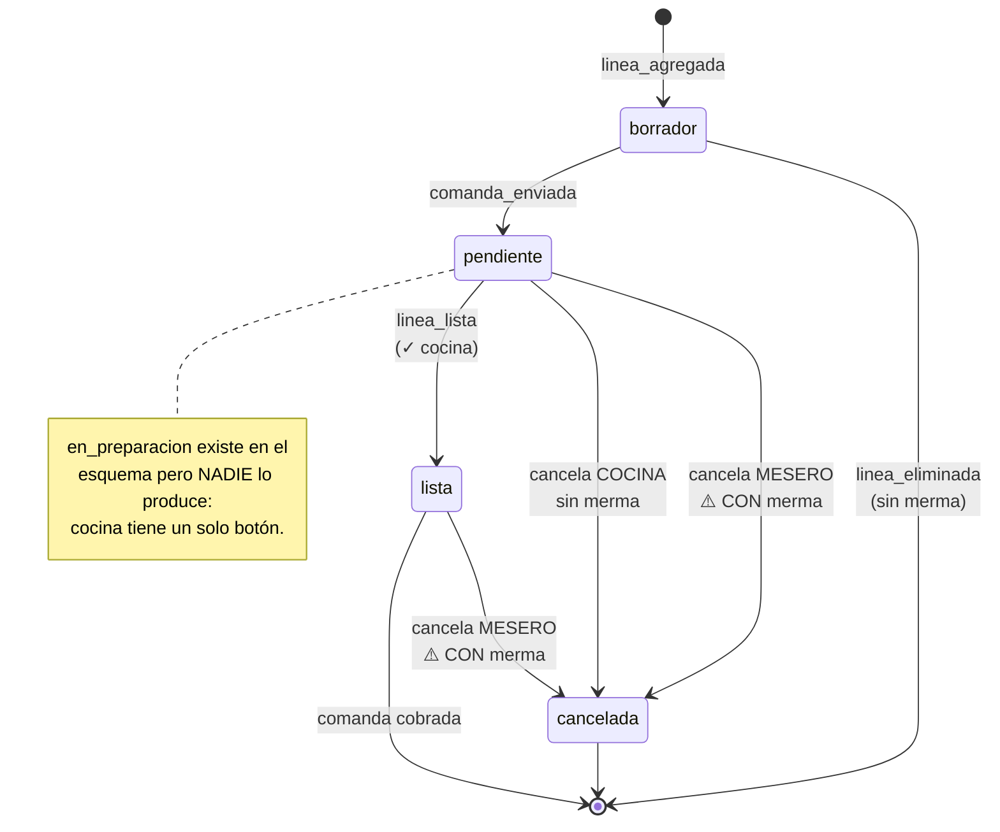
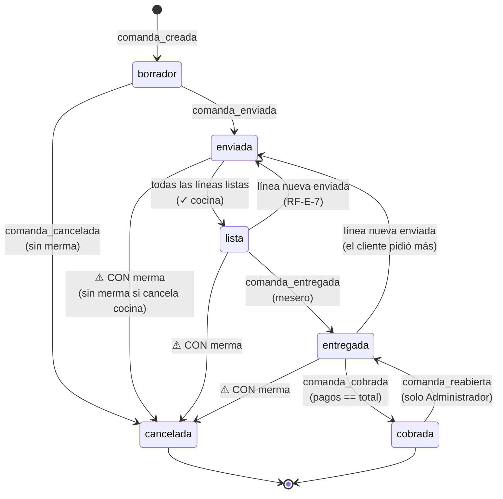
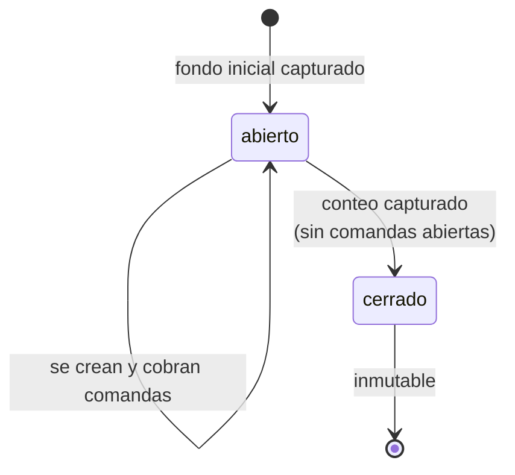
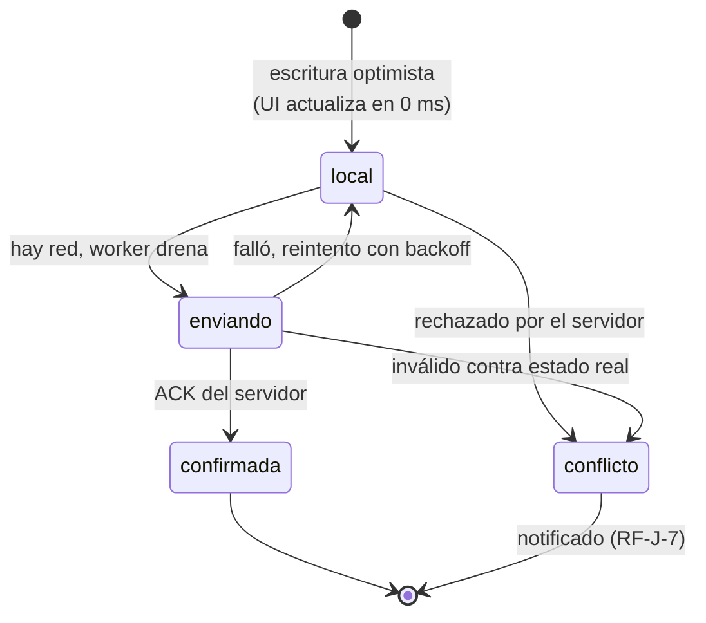

# 05. Casos de Uso y Diagramas de Estado

**Proyecto:** Leña — Sistema de comandas y gestión de restaurantes pequeños
**Versión del documento:** 1.0
**Fecha:** 2026-07-15
**Autor:** Carlos González Laines
**Depende de:** [03. Requisitos funcionales](./3.-Requisitos%20funcionales.md), [04. Modelo de datos](./4.-Modelo%20de%20datos.md)

## Registro de cambios

| Versión | Fecha | Autor | Cambio |
|---|---|---|---|
| 1.0 | 2026-07-15 | Carlos González Laines | Casos de uso del MVP y máquinas de estado |

---

## 1. Actores



| Actor | Alcance | Autenticación |
|---|---|---|
| **Administrador Central** | Todas las sucursales | Email + contraseña (RF-A-1) |
| **Mesero** | Su sucursal | PIN en dispositivo registrado (RF-A-2) |
| **Cocinero** | Su sucursal | PIN en dispositivo registrado (RF-A-2) |
| **Sistema** | — | Actúa por sí mismo: sincroniza, proyecta estados, notifica |

**El Administrador puede hacer todo lo que hacen Mesero y Cocinero**, además de lo suyo. En los casos de uso se omite mencionarlo cada vez.

---

## 2. Mapa de casos de uso

```mermaid
graph TB
    subgraph Servicio
        CU01[CU-01 Levantar comanda]
        CU02[CU-02 Enviar a cocina]
        CU03[CU-03 Preparar comanda]
        CU04[CU-04 Entregar comanda]
        CU05[CU-05 Cobrar comanda]
        CU06[CU-06 Cancelar con merma]
        CU07[CU-07 Comanda a domicilio]
    end

    subgraph Caja
        CU08[CU-08 Abrir turno]
        CU09[CU-09 Cerrar turno]
    end

    subgraph Administración
        CU10[CU-10 Gestionar producto]
        CU11[CU-11 Cambiar precio]
        CU12[CU-12 Consultar finanzas]
        CU13[CU-13 Gestionar usuarios]
    end

    subgraph Sistema
        CU14[CU-14 Sincronizar tras desconexión]
    end

    MES([Mesero]) --> CU01 & CU02 & CU04 & CU05 & CU06 & CU07 & CU08 & CU09
    COC([Cocinero]) --> CU03
    ADM([Admin]) --> CU10 & CU11 & CU12 & CU13 & CU09
    SYS([Sistema]) --> CU14

    CU01 -.->|requiere| CU08
    CU05 -.->|requiere| CU04
    CU06 -.->|genera| MP[Merma de producto]
```



---

## 3. Casos de uso detallados

### CU-01 — Levantar comanda

| | |
|---|---|
| **Actor** | Mesero |
| **Requisitos** | RF-E-1 a RF-E-5, RF-E-10, RF-E-13, RF-E-14, RF-H-2, RF-H-3 |
| **Precondición** | Sesión activa. **Existe un turno de caja abierto en la sucursal** |
| **Postcondición** | Comanda en `borrador` con ≥1 línea, encolada para sincronizar |

**Flujo principal**

1. El Mesero elige tipo de servicio: mesa, para llevar o domicilio.
2. Si es mesa, selecciona la mesa. Si es domicilio, continúa en CU-07.
3. El sistema genera un `id` UUIDv7 **en el dispositivo** y crea la comanda en `borrador`.
4. El Mesero busca un producto y lo agrega con su cantidad.
5. El sistema copia `nombre_producto` y `precio_unitario` **vigentes en ese momento** a la línea (ADR-006).
6. El Mesero agrega una nota a la línea si aplica ("sin cebolla").
7. Repite 4-6 por cada producto.
8. El sistema calcula y muestra el total con los precios de las líneas.

**Flujos alternativos**

| # | Condición | Comportamiento |
|---|---|---|
| A1 | No hay turno de caja abierto | El sistema bloquea la creación y ofrece abrir turno (CU-08). RF-H-3 |
| A2 | Sin conexión | Todo el flujo funciona igual. La comanda se marca "solo en este dispositivo" (RF-E-14) |
| A3 | Producto marcado no disponible | No aparece en la búsqueda (RF-D-7) |
| A4 | El Mesero corrige cantidad o nota | Permitido: la línea está en `borrador` (RF-E-4) |
| A5 | El Mesero elimina una línea | Permitido en `borrador`, sin merma (RF-E-5) |

**Nota de diseño:** el paso 5 es el corazón de ADR-006. El precio se **copia**, no se referencia. Si el Administrador sube el precio entre el paso 5 y el cobro, esta comanda mantiene el precio que el cliente vio al ordenar.

---

### CU-02 — Enviar comanda a cocina

| | |
|---|---|
| **Actor** | Mesero |
| **Requisitos** | RF-E-6, RF-E-7, RF-E-13, RF-F-1, RF-F-2 |
| **Precondición** | Comanda con ≥1 línea en `borrador` |
| **Postcondición** | Líneas en `pendiente`, comanda en `enviada`, cocina notificada |

**Flujo principal**

1. El Mesero confirma el envío.
2. El sistema registra el evento `comanda_enviada` y pasa las líneas en `borrador` a `pendiente`, sellando su `enviada_at`.
3. El sistema encola el evento en la outbox y actualiza la UI de inmediato.
4. Al sincronizar, el servidor **asigna el folio** secuencial de la sucursal (RF-E-13).
5. El servidor emite `NOTIFY`; la pantalla de cocina recibe la comanda por WebSocket y suena la alerta (RF-F-2).
6. La UI del Mesero marca la comanda como "confirmada" (RF-E-14).

**Flujos alternativos**

| # | Condición | Comportamiento |
|---|---|---|
| B1 | Sin conexión | Pasos 1-3 ocurren normal. Los pasos 4-6 quedan pendientes. La comanda **no tiene folio** y la UI muestra su identificador local. Cocina **no la ve** hasta que vuelva la red (ADR-004, Nivel 1) |
| B2 | La comanda ya estaba enviada y se agregaron líneas nuevas | Solo se envían las líneas en `borrador`, como **adición**. Las anteriores conservan su estado. La comanda vuelve a `enviada` por derivación (§4.3) y cocina la ve otra vez (RF-E-7) |
| B3 | El envío falla por red | Reintento automático. Es idempotente por `id` de evento, así que no duplica (RF-J-3) |

**B1 es el límite honesto del Nivel 1** y es la razón de existir de RF-E-14: el mesero **ve** que cocina no la ha recibido y actúa en consecuencia — se lo dice de viva voz, como hace hoy. No se pierde la comanda; se pierde la ventaja durante la caída.

**B2 es el caso que más se repite en una taquería:** la mesa pide más tacos a media comida. Funciona sin lógica especial gracias a la derivación del estado (§4.3).

---

### CU-03 — Preparar comanda

| | |
|---|---|
| **Actor** | Cocinero |
| **Requisitos** | RF-F-1, RF-F-2, RF-F-4, RF-F-5, RF-F-7, RF-F-8, RF-F-10 a RF-F-15 |
| **Precondición** | Comanda en `enviada` en su sucursal |
| **Postcondición** | Comanda en `lista`, Mesero notificado |

**Flujo principal**

1. El Cocinero ve la comanda aparecer en tiempo real como tarjeta, ordenada por antigüedad, con su tipo de servicio visible (RF-F-12). Suena la alerta (RF-F-2).
2. El sistema muestra el cronómetro desde el envío; la tarjeta cambia de color al pasar los umbrales (RF-F-7, RF-F-8).
3. El Cocinero prepara y toca **✓** → líneas a `lista`, se sella `lista_at`.
4. El sistema notifica al Mesero autor (RF-F-5).

**Un solo toque por comanda.** No hay paso de "empezar": el estado `en_preparacion` no se produce en el MVP. Es una decisión de simplicidad de `09. Diseño de interfaz`, y su consecuencia sobre la merma se resuelve en CU-06.

**Flujos alternativos**

| # | Condición | Comportamiento |
|---|---|---|
| C1 | Llega una adición a una comanda ya `lista` | La comanda **reaparece** como `enviada` y suena la alerta otra vez. Las líneas ya servidas se muestran **tachadas y en gris**; las nuevas, destacadas (RF-E-7) |
| C2 | El Mesero cancela algo que cocina ya tiene | Alerta destacada en la tarjeta: dejen de hacerlo (RF-F-11) |
| C3 | **Se acabó un insumo y aún nadie lo pidió** | El Cocinero marca el producto **no disponible**; desaparece de las tablets al instante (RF-F-10, RF-D-7) |
| C4 | **Se acabó un insumo y ya está pedido** | El Cocinero **cancela la línea** con motivo (RF-F-13). **No genera merma** (RF-F-14): nunca se preparó. Se notifica al Mesero de forma destacada para que lo resuelva con el cliente (RF-F-15) |
| C5 | La comanda supera el umbral de tiempo | La tarjeta cambia de color: ámbar → naranja → rojo (RF-F-8) |

**C3 y C4 son la misma situación con distinto momento, y por eso hacen falta las dos.** "Se acabó el pastor" tiene dos consecuencias independientes: que **nadie más lo pida** (C3) y que **lo ya pedido se resuelva** (C4). Con solo una de las dos, cocina se queda atorada o el mesero sigue vendiendo lo que no existe.

**C4 no cancela a espaldas del cliente.** Cocina cancela la línea y el Mesero recibe el aviso destacado; es él quien va con el cliente a ofrecerle otra cosa. El sistema no decide por el negocio: solo hace que la información llegue a quien puede actuar.

---

### CU-04 — Entregar comanda

| | |
|---|---|
| **Actor** | Mesero |
| **Requisitos** | RF-E-22, RF-E-23 |
| **Precondición** | Todas las líneas no canceladas están en `lista` |
| **Postcondición** | Comanda en `entregada`. **Se habilita el cobro** |

**Flujo principal**

1. El Mesero recibe la notificación de comanda lista (RF-F-5).
2. Lleva la comida al cliente.
3. Marca la comanda como entregada.
4. El sistema habilita la función de cobro (RF-E-23).

**Flujos alternativos**

| # | Condición | Comportamiento |
|---|---|---|
| D1 | El cliente pide más después de que le sirvieron | Se agregan líneas en `borrador` y se envían. La comanda **sale de `entregada`** y vuelve a `enviada` (§4.3). El cobro se deshabilita hasta entregar lo nuevo |
| D2 | El Mesero intenta cobrar sin entregar | Bloqueado (RF-G-7) |

**D1 es sutil y es la razón por la que `entregada` no es terminal.** Si fuera un estado final, pedir un taco extra después de servir rompería el flujo. Con derivación, el sistema se acomoda solo y el cobro se vuelve a habilitar cuando todo esté entregado.

**Por qué `entregada` existe como paso aparte** en vez de cobrar directo desde `lista`: separa el tiempo de cocina del tiempo de mesero. Si un plato tarda, el gerente necesita saber si se tardó la cocina o si se quedó enfriándose en la barra. Son dos problemas distintos con dos soluciones distintas.

---

### CU-05 — Cobrar comanda

| | |
|---|---|
| **Actor** | Mesero |
| **Requisitos** | RF-G-1 a RF-G-7, RF-H-2 |
| **Precondición** | Comanda en `entregada` |
| **Postcondición** | Comanda en `cobrada` (terminal). Pagos ligados al turno |

**Flujo principal**

1. El Mesero abre el cobro y ve el total.
2. Elige método: efectivo, tarjeta o transferencia.
3. Si es efectivo, captura lo recibido y el sistema calcula el cambio (RF-G-4).
4. Si es tarjeta o transferencia, captura referencia opcional (RF-G-5).
5. El sistema valida que la suma de pagos **iguale exactamente** el total (RF-G-6).
6. Registra `comanda_cobrada`, sella `cerrada_at` y la comanda queda en el turno abierto.

**Flujos alternativos**

| # | Condición | Comportamiento |
|---|---|---|
| E1 | Pago dividido | Se registran varias filas en `pago` con distintos métodos hasta cubrir el total (RF-G-3) |
| E2 | Los pagos no suman el total | Bloqueado. El sistema muestra el faltante o el sobrante (RF-G-6) |
| E3 | Se cobró por error | Solo el Administrador reabre, con motivo (RF-G-8). Vuelve a `entregada` |
| E4 | Sin conexión | El cobro se registra local y se encola. El corte de caja lo considera de inmediato porque se calcula sobre el estado local |

**El cobro en tarjeta no procesa nada.** Registra "esto se pagó con tarjeta" para que el corte cuadre. El cobro físico ocurre en la terminal del banco, fuera de Leña.

---

### CU-06 — Cancelar comanda o línea (con merma)

| | |
|---|---|
| **Actor** | Mesero, Administrador y **Cocinero** (con reglas distintas) |
| **Requisitos** | RF-E-8, RF-E-9, RF-E-18 a RF-E-21, RF-F-11, RF-F-13 a RF-F-15, RF-I-9, RF-I-10 |
| **Precondición** | Comanda no `cobrada` |
| **Postcondición** | Comanda o línea en `cancelada`. Merma registrada **según quién canceló** |

**Flujo principal — cancela el Mesero**

1. El Mesero pide cancelar una línea o la comanda completa.
2. **El sistema calcula qué se va a mermar**: las líneas **ya enviadas a cocina**.
3. **El sistema advierte con números concretos** (RF-E-18):
   > *"2 tacos de pastor ya están en cocina. Cancelar los registra como merma por $36. ¿Continuar?"*
4. El Mesero captura el motivo (obligatorio) y confirma.
5. El sistema registra `comanda_cancelada` o `linea_cancelada`.
6. **Por cada línea ya enviada**, inserta una fila en `merma_producto` con cantidad, costo estimado, motivo, autor y el estado que tenía al cancelar (RF-E-19).
7. Las líneas en `borrador` se cancelan **sin merma** (RF-E-20).
8. El sistema alerta a cocina de forma destacada (RF-F-11).
9. La cancelación queda disponible para el Administrador en su apartado (RF-I-9).

**Flujo alterno — cancela el Cocinero (RF-F-13)**

1. Cocina no puede preparar una línea: se acabó el insumo.
2. El Cocinero cancela la línea con motivo obligatorio.
3. **No se registra merma** (RF-F-14). No hay advertencia de costo: no hay costo.
4. El sistema notifica al Mesero autor de forma destacada (RF-F-15) para que lo resuelva con el cliente.
5. La cancelación igual queda registrada para el Administrador (RF-I-9).

**Flujos alternativos**

| # | Condición | Comportamiento |
|---|---|---|
| F1 | La línea seguía en `borrador` | La advertencia del paso 3 dice que no hay merma. Se cancela limpio |
| F2 | **Cocina marca `lista` mientras el Mesero cancela** | **La cancelación gana** (RF-E-21). La merma se registra con el estado real que tenía la línea según el orden HLC |
| F3 | El evento de cancelación llega tarde por sync y la comanda ya está `lista` | Igual: la cancelación gana y se registra la merma. Cocina recibe la alerta al reconectar |
| F4 | El evento de cancelación llega y la comanda ya está `cobrada` | **No se aplica.** Se registra como conflicto y se notifica (RF-J-7). Cobrada es terminal; deshacerlo es potestad del Administrador (RF-G-8) |
| F5 | **Cocina y Mesero cancelan la misma línea a la vez** | Gana el de **menor HLC**. Si fue cocina, no hay merma; si fue el mesero, sí. El resultado es determinista y ambos convergen |

**Quién cancela determina si hay merma, y no hace falta preguntárselo a nadie:**

| Quién | ¿Merma? | Qué sabe esa persona |
|---|---|---|
| Mesero / Administrador | **Sí** | El cliente se fue. La comida se hizo y se va a tirar |
| **Cocinero** | **No** | *No pudo* prepararla. Esa comida nunca existió |

**Quien sabe si la comida se hizo es el cocinero.** Por eso su cancelación es autoritativa: cada actor aporta, con el solo hecho de cancelar, el dato que únicamente él tiene. La alternativa —preguntar "¿ya se había preparado?"— pondría la decisión en quien no lo sabe y añadiría un toque en hora pico.

**F5 tiene una consecuencia contable que conviene ver de frente:** si cocina y mesero cancelan casi a la vez, que haya merma o no depende de milisegundos de HLC. Es una rareza estadística sin impacto material —hablamos de una línea suelta— y la alternativa (bloquear la cancelación concurrente) costaría más de lo que arregla.

**Por qué la cancelación gana (F2, F3):** bloquearla no cambia la realidad física. El cliente ya se fue; esa comida ya no se vende. Impedir la cancelación solo empuja al mesero a mentirle al sistema — cobrar y "regalar" el plato — y entonces la merma desaparece de los datos. Dejarla pasar y **contabilizarla** convierte una pérdida invisible en un número que el gerente puede ver. Eso es exactamente el problema de la Visión §1.

**Por qué la advertencia del paso 3 no es cortesía:** sin ella, cancelar es psicológicamente gratis. Ponerle precio en el momento cambia la conducta del mesero y hace que la merma sea una decisión consciente y no un accidente.

**F4 es el único caso donde la cancelación pierde**, y es correcto: el dinero ya entró y está en un turno que puede estar cerrado. Revertirlo en automático descuadraría un corte ya firmado.

---

### CU-07 — Comanda a domicilio

| | |
|---|---|
| **Actor** | Mesero |
| **Requisitos** | RF-E-1, RF-E-17, RF-E-22, RF-F-12 |
| **Precondición** | Turno abierto |
| **Postcondición** | Comanda con datos de entrega, cocina notificada |

**Flujo principal**

1. Entra la llamada. El Mesero crea la comanda de tipo `domicilio`.
2. Captura nombre, **teléfono y dirección** (los dos últimos obligatorios) y referencias opcionales.
3. Levanta las líneas igual que CU-01.
4. Envía a cocina (CU-02). Cocina la ve marcada como domicilio (RF-F-12).
5. Cuando está lista, **quien esté libre** la lleva.
6. Al volver, se marca `entregada` y se cobra (CU-04, CU-05).

**Flujos alternativos**

| # | Condición | Comportamiento |
|---|---|---|
| G1 | Cliente frecuente | Se busca por teléfono y se rellenan los datos. Hay índice sobre `comanda_domicilio.telefono` |
| G2 | Cobra alguien distinto de quien la levantó | Permitido: `pago.actor_id` es independiente de `comanda.mesero_id` |
| G3 | El cliente no estaba / rechazó el pedido | Se cancela (CU-06). **Toda la comanda se va a merma** — ya estaba preparada |

**No hay rol `Repartidor` por decisión del negocio:** entrega quien esté libre. El sistema no lo modela y G2 muestra que el modelo ya lo soporta sin cambios.

**G3 es el peor caso económico del negocio** — comida hecha, viaje hecho, cero ingreso — y por eso es valioso que quede registrado con motivo. Si se repite con un teléfono, el gerente tiene evidencia para pedir anticipo.

---

### CU-08 — Abrir turno de caja

| | |
|---|---|
| **Actor** | Mesero o Administrador |
| **Requisitos** | RF-H-1, RF-H-3 |
| **Precondición** | **No hay turno abierto** en la sucursal |
| **Postcondición** | Turno `abierto`. Se pueden crear comandas |

1. El usuario captura el fondo inicial de caja.
2. El sistema crea el `corte_caja` en `abierto`.
3. Toda comanda creada desde ahora se liga a este turno (RF-H-2).

| # | Condición | Comportamiento |
|---|---|---|
| H1 | Ya hay un turno abierto | Bloqueado por el índice `corte_abierto_uq`. Se ofrece continuarlo |

**H1 lo garantiza la base de datos, no la aplicación.** Es un índice único parcial. Dos turnos abiertos simultáneos repartirían las comandas entre ambos y ningún corte cuadraría jamás.

---

### CU-09 — Cerrar turno de caja

| | |
|---|---|
| **Actor** | Mesero o Administrador |
| **Requisitos** | RF-H-4 a RF-H-10 |
| **Precondición** | Turno `abierto`, **sin comandas abiertas** |
| **Postcondición** | Turno `cerrado` e inmutable |

**Flujo principal**

1. El usuario pide cerrar el turno.
2. El sistema verifica que no haya comandas abiertas (RF-H-8).
3. Calcula el efectivo esperado: `fondo_inicial + Σ pagos en efectivo`.
4. Muestra el desglose por método de pago (RF-H-6).
5. El usuario cuenta el dinero físico y captura el monto (RF-H-5).
6. El sistema calcula la diferencia.
7. Si supera el umbral, exige motivo escrito (RF-H-7).
8. El turno pasa a `cerrado` y queda inmutable (RF-H-10).

| # | Condición | Comportamiento |
|---|---|---|
| I1 | Hay comandas abiertas | Bloqueado. El sistema **las lista** para cobrarlas o cancelarlas (RF-H-8) |
| I2 | Hay eventos sin sincronizar | Se advierte. El corte se calcula sobre el estado local, que es completo; al sincronizar cuadra igual |
| I3 | Hay que corregir un turno cerrado | No se edita. El Administrador registra un ajuste (RF-H-10) |

**I1 es lo que hace que el corte signifique algo.** Una comanda abierta al cierre es comida entregada sin cobrar: o se cobra, o se cancela con su merma. Dejarla en el limbo hace que el corte mienta.

---

### CU-10 / CU-11 — Gestionar producto y cambiar precio

| | |
|---|---|
| **Actor** | Administrador |
| **Requisitos** | RF-D-1 a RF-D-9 |

**Flujo — cambiar precio (CU-11)**

1. El Administrador edita el precio de un producto.
2. El sistema actualiza `producto.precio_base`.
3. Registra el cambio en `producto_precio_historial` con autor, valor anterior y nuevo (RF-D-4).
4. El precio nuevo aplica **solo a líneas creadas a partir de ahora**.
5. **Ninguna comanda existente cambia de total** — ni las abiertas (RF-D-3).

| # | Condición | Comportamiento |
|---|---|---|
| J1 | Baja lógica de un producto | `activo = false`. Desaparece de la captura; el historial queda intacto (RF-D-5) |
| J2 | Se acabó temporalmente | `disponible = false`. Vuelve solo con reactivarlo (RF-D-7) |
| J3 | Hay una comanda abierta con ese producto | No pasa nada. Su línea ya tiene el precio y el nombre copiados |

**El paso 5 es el criterio de aceptación más importante del módulo D** y merece una prueba automatizada propia: cambiar un precio y verificar que el total de una comanda abierta **no** se mueve. Es el tipo de bug que nadie nota hasta el corte del día.

---

### CU-14 — Sincronizar tras desconexión

| | |
|---|---|
| **Actor** | Sistema |
| **Requisitos** | RF-J-1 a RF-J-8 |
| **Precondición** | Hay eventos en la outbox o el cursor está atrasado |
| **Postcondición** | Dispositivo y servidor convergen |

**Flujo principal**

1. El dispositivo detecta que hay red.
2. **Push:** envía los eventos pendientes en lotes → `POST /sync/push`.
3. El servidor inserta con `ON CONFLICT (id) DO NOTHING` (RF-J-3), asigna folios a las comandas nuevas y emite `NOTIFY`.
4. El dispositivo marca los eventos como sincronizados y actualiza los folios recibidos.
5. **Pull:** pide `GET /sync/pull?desde={cursor}` y recibe los eventos ajenos de su sucursal.
6. Aplica los eventos ajenos, **ordenándolos por HLC** contra los propios, y recalcula las proyecciones.
7. Guarda el nuevo cursor. Reabre el WebSocket para tiempo real.

**Flujos alternativos**

| # | Condición | Comportamiento |
|---|---|---|
| K1 | La red cae a media sincronización | El lote se reintenta completo. Idempotente: no duplica (RF-J-3) |
| K2 | Un evento resulta inválido contra el estado del servidor | **No se descarta en silencio.** Se registra como conflicto y se notifica (RF-J-7) |
| K3 | Los relojes están desfasados | El HLC ordena correctamente pese al reloj físico (ADR-003) |
| K4 | Hubo eventos concurrentes sobre la misma comanda | Se pliegan por HLC. Las reglas de negocio (F2, F4) deciden el resultado |

**K2 es la regla que impide perder dinero en silencio.** Un evento descartado sin avisar es una comanda que nadie cobró y de la que nadie se enteró. Prefiero un conflicto ruidoso que un peso perdido en calma.

---

## 4. Máquinas de estado

### 4.1 Línea de comanda — el estado fundamental

Todo lo demás se deriva de aquí.



**La frontera de la merma es el envío a cocina.** A la izquierda (`borrador`), la línea no existió para nadie. A la derecha, en una taquería el pastor se corta al momento: "enviada" y "haciéndose" son lo mismo. El `CHECK solo_si_ya_estaba_en_cocina` de `merma_producto` lo hace cumplir en la base.

**Y hay una segunda dimensión que no es el estado, sino el actor.** Las dos flechas que salen de `pendiente` hacia `cancelada` van al mismo estado y producen resultados distintos:

| Quién cancela | ¿Merma? | Qué sabe esa persona |
|---|---|---|
| Mesero / Administrador | **Sí** | El cliente se fue. La comida se hizo y se tira |
| **Cocinero** | **No** | *No pudo* prepararla — se acabó el insumo. Nunca existió |

**Quien sabe si la comida se hizo es el cocinero.** Por eso su cancelación es autoritativa y no hace falta preguntarle nada ni añadir un campo a la interfaz: **quién cancela ya codifica lo que esa persona sabe.**

### 4.2 Comanda — derivada de sus líneas



**Las dos transiciones hacia atrás no son errores de diseño, son el negocio real:**

- `lista → enviada` y `entregada → enviada`: la mesa pidió más tacos. Sin ellas habría que abrir una comanda nueva y el cliente recibiría dos cuentas.
- `cobrada → entregada`: solo el Administrador, con motivo (RF-G-8).

### 4.3 La función de proyección

`comanda.estado` es una **proyección cacheada** (P1). Esta es su definición exacta, y vive en `packages/shared` para que cliente y servidor no puedan divergir:

```ts
function proyectarEstadoComanda(c: Comanda, lineas: Linea[], eventos: Evento[]): EstadoComanda {
  // 1. Los estados explícitos terminales mandan.
  if (ultimoEvento(eventos, 'comanda_cancelada')) return 'cancelada';
  if (ultimoEvento(eventos, 'comanda_cobrada'))   return 'cobrada';

  const activas = lineas.filter(l => l.estado !== 'cancelada');

  // 2. Comanda sin líneas activas: sigue siendo capturable.
  if (activas.length === 0) return 'borrador';

  // 3. Si alguna línea sigue en borrador y ninguna se ha enviado → borrador.
  if (activas.every(l => l.estado === 'borrador')) return 'borrador';

  // 4. Estado derivado del mínimo avance entre las líneas ya enviadas.
  //    'en_preparacion' se contempla aunque el MVP no lo produzca (un solo botón en cocina).
  const enviadas = activas.filter(l => l.estado !== 'borrador');
  if (enviadas.some(l => l.estado === 'pendiente'))      return 'enviada';
  if (enviadas.some(l => l.estado === 'en_preparacion')) return 'en_preparacion';

  // 5. Todas las enviadas están listas. ¿Quedan líneas en borrador sin enviar?
  //    Si sí, la comanda no puede considerarse entregada.
  const hayBorradores = activas.some(l => l.estado === 'borrador');
  if (hayBorradores) return 'enviada';

  // 6. 'entregada' solo si el evento es POSTERIOR (por HLC) a la última línea enviada.
  //    Esto es lo que hace que "el cliente pidió más" revierta la entrega.
  const entregada = ultimoEvento(eventos, 'comanda_entregada');
  const ultimoEnvio = maxHlc(enviadas.map(l => l.enviadaHlc));
  if (entregada && compararHlc(entregada.hlc, ultimoEnvio) > 0) return 'entregada';

  return 'lista';
}
```

**El paso 6 es el más delicado del sistema.** El evento `comanda_entregada` no es un interruptor permanente: solo vale si ocurrió *después* del último envío de líneas. Sin esa comparación por HLC, una comanda entregada a la que se le agregan tacos seguiría diciendo `entregada` y se podría cobrar sin haber servido lo nuevo.

Comparar por HLC y no por `ts_cliente` importa (ADR-003): con relojes desfasados, un `timestamp` puede hacer parecer que la entrega ocurrió después de una adición que en realidad la siguió.

**Esta función es la única definición del estado.** Cliente y servidor la importan del mismo módulo. Si divergieran, el sync produciría estados imposibles — y el bug aparecería en producción, en hora pico, sin forma de reproducirlo.

### 4.4 Corte de caja



| Guarda | Regla |
|---|---|
| `[*] → abierto` | No puede existir otro turno abierto en la sucursal (índice `corte_abierto_uq`) |
| `abierto → cerrado` | **Cero comandas abiertas** (RF-H-8) |
| `abierto → cerrado` | Motivo obligatorio si `|diferencia| > umbral` (RF-H-7) |
| `cerrado → *` | No existe. Corregir = registrar un ajuste (RF-H-10) |

### 4.5 Evento en la outbox — el estado que ve el mesero



Estos tres estados —`local`, `enviando`, `confirmada`— son los que RF-E-14 obliga a mostrar en pantalla. **No es decoración.** Es la diferencia entre un mesero que sabe que la cocina no ha visto su comanda y uno que asume que sí.

El estado `conflicto` **nunca es silencioso** (RF-J-7). Es raro por diseño —los INSERT de ADR-002 casi no chocan— pero cuando ocurre significa que algo del mundo real no cuadra, y eso siempre lo tiene que resolver una persona.

---

## 5. Matriz de conflictos concurrentes

Qué pasa cuando dos eventos sobre la misma comanda llegan desordenados. **Estas reglas viven en `packages/shared` y son idénticas en cliente y servidor.**

| Evento A | Evento B (concurrente) | Resultado | Razón |
|---|---|---|---|
| `comanda_cancelada` | `comanda_lista` | **Cancelada** + merma | RF-E-21. La comida existe; se contabiliza |
| `comanda_cancelada` | `linea_agregada` | **Cancelada**; la línea nueva nace cancelada, sin merma | La comanda ya no existe para el negocio |
| `comanda_cancelada` | `comanda_cobrada` | **Cobrada** gana; cancelación → conflicto | El dinero ya entró, posiblemente en un turno cerrado (F4) |
| `comanda_cobrada` | `linea_agregada` | Cobrada gana; la línea → conflicto | Alterar una comanda cobrada descuadra el corte |
| `linea_lista` | `linea_cancelada` (mesero) | **Cancelada** + merma | Misma regla que la primera fila |
| `linea_cancelada` (cocina) | `linea_cancelada` (mesero) | El de **menor** HLC; determina si hay merma | Determinista. Ver CU-06 F5 |
| `linea_lista` (2 cocineros) | idem | El de menor HLC; el otro se ignora | Idempotente; el resultado es el mismo |
| `linea_modificada` | `linea_modificada` | Gana el de **mayor** HLC | Last-write-wins. Es un campo de texto o una cantidad, no dinero |
| `comanda_entregada` | `linea_agregada` posterior | Vuelve a `enviada` | §4.3 paso 6 |

**Hay dos políticas distintas y la diferencia importa:**

- **Cancelación → gana siempre** (menos contra `cobrada`). Es irreversible en el mundo físico: el cliente se fue.
- **Modificación → gana el más reciente.** Es un dato editable sin consecuencia económica.

Aplicar last-write-wins a las cancelaciones sería un error grave: una cancelación que llega tarde por sync se perdería, y la comida ya tirada nunca aparecería en la merma.

---

## 6. Trazabilidad

| Caso de uso | Requisitos cubiertos |
|---|---|
| CU-01 | RF-E-1 a RF-E-5, RF-E-10, RF-E-14, RF-H-3 |
| CU-02 | RF-E-6, RF-E-7, RF-E-13, RF-F-1, RF-F-2 |
| CU-03 | RF-F-1 a RF-F-8, RF-F-11, RF-F-12 |
| CU-04 | RF-E-22, RF-E-23 |
| CU-05 | RF-G-1 a RF-G-7 |
| CU-06 | RF-E-8, RF-E-9, RF-E-18 a RF-E-21, RF-F-11, RF-I-9, RF-I-10 |
| CU-07 | RF-E-17, RF-F-12 |
| CU-08 | RF-H-1, RF-H-3 |
| CU-09 | RF-H-4 a RF-H-10 |
| CU-10, CU-11 | RF-D-1 a RF-D-9 |
| CU-12 | RF-I-1 a RF-I-11 |
| CU-13 | RF-C-1 a RF-C-5, RF-A-4, RF-A-8 |
| CU-14 | RF-J-1 a RF-J-8 |
