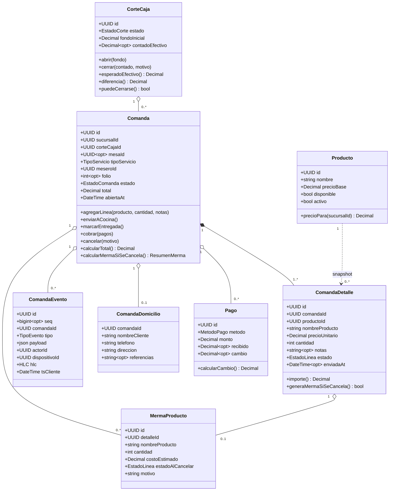
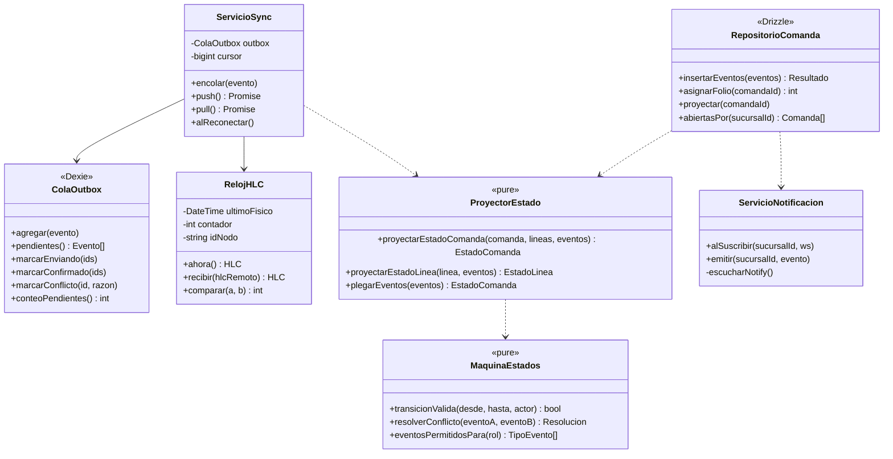
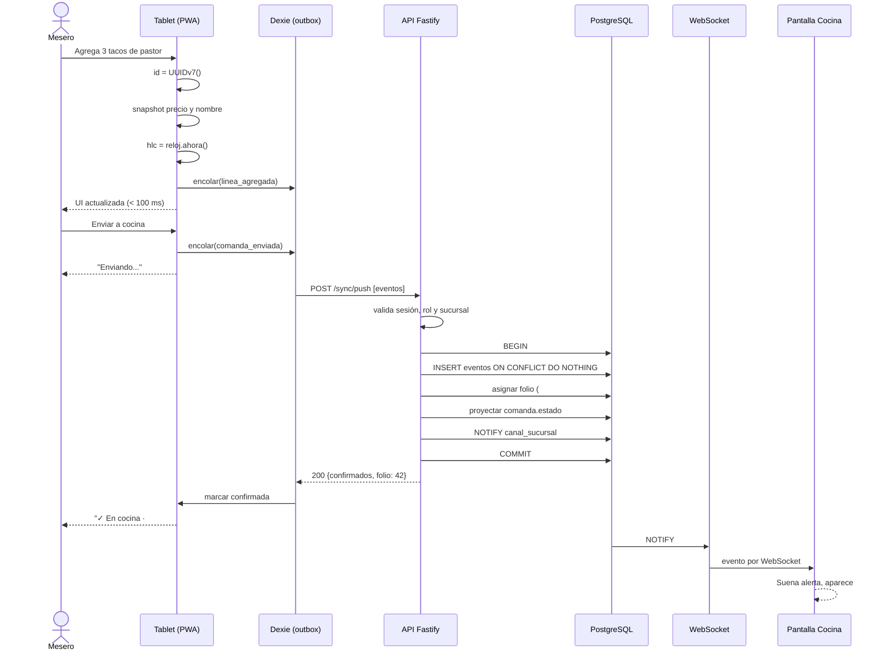
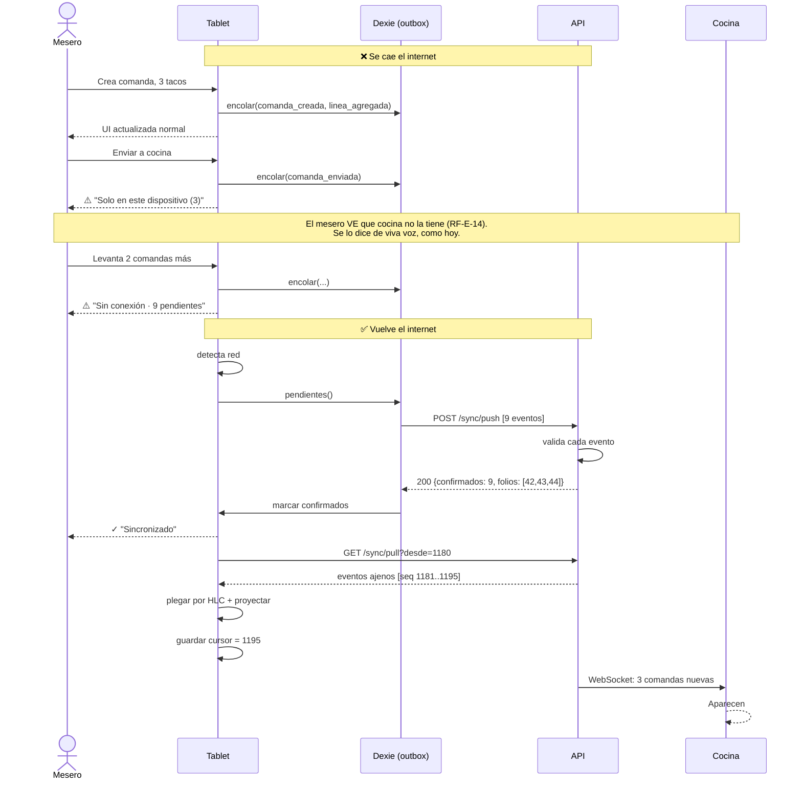
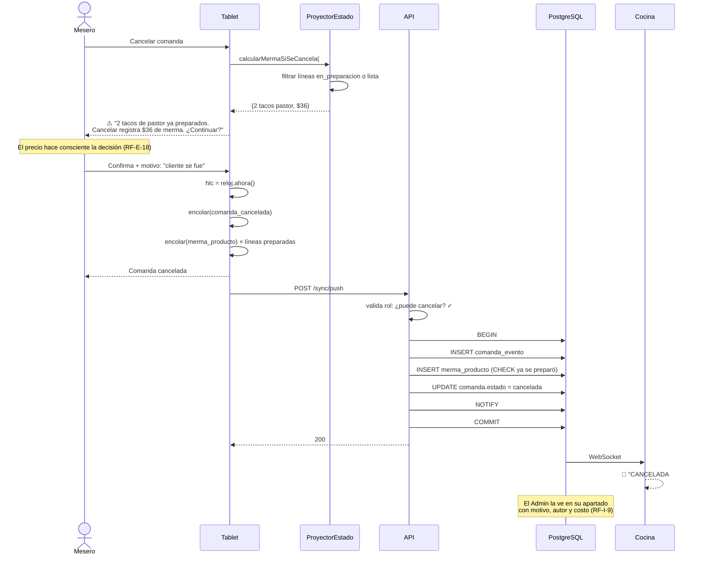
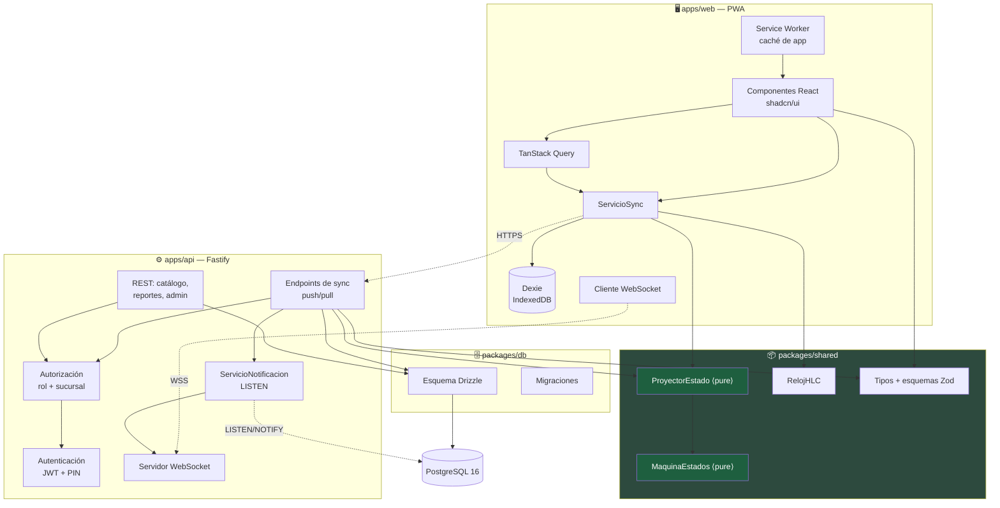
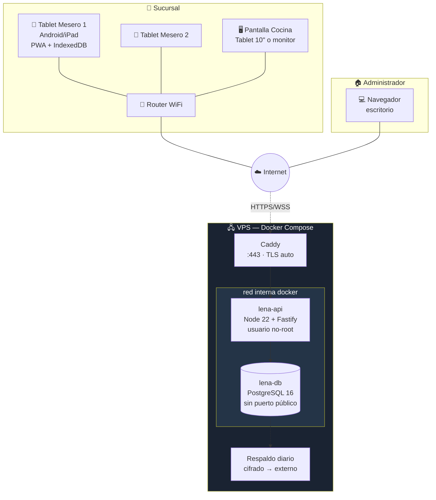
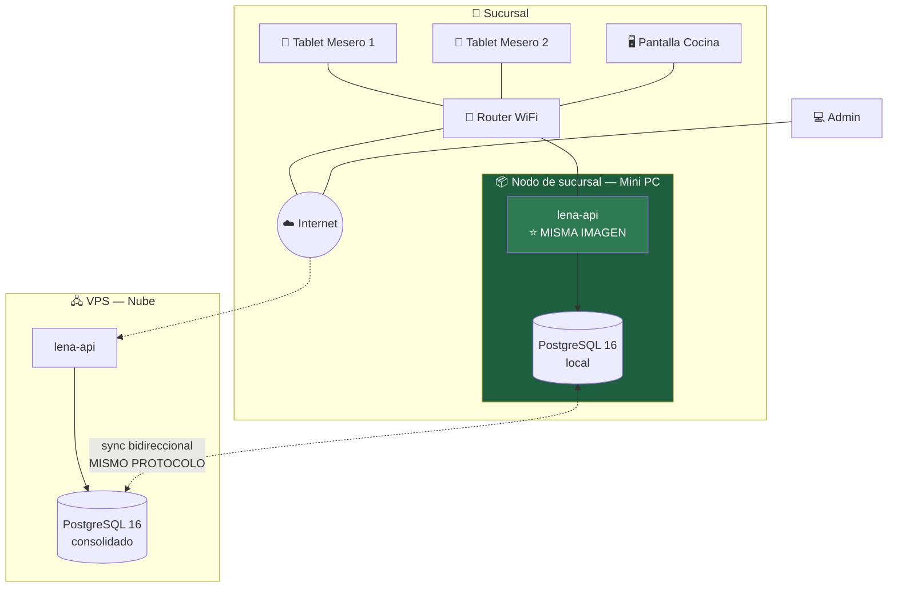
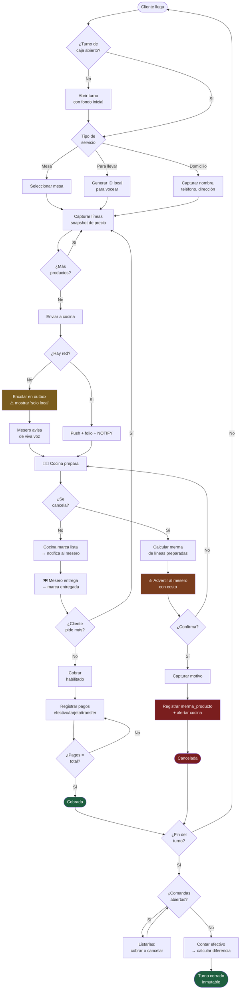

# 08. Diagramas UML

**Proyecto:** Leña — Sistema de comandas y gestión de restaurantes pequeños
**Versión del documento:** 1.0
**Fecha:** 2026-07-15
**Autor:** Carlos González Laines
**Depende de:** [02. Arquitectura](./2.-Arquitectura.md), [04. Modelo de datos](./4.-Modelo%20de%20datos.md), [05. Casos de uso](./5.-Casos%20de%20uso%20y%20diagramas%20de%20estado.md)

## Registro de cambios

| Versión | Fecha | Autor | Cambio |
|---|---|---|---|
| 1.0 | 2026-07-15 | Carlos González Laines | Diagramas de clases, secuencia, componentes, despliegue y actividad |

---

## 1. Alcance

Las **máquinas de estado** viven en `05. Casos de uso y diagramas de estado` §4 y el **modelo entidad-relación** en `04. Modelo de datos` §2. Aquí están los cinco que faltan: **clases**, **secuencia**, **componentes**, **despliegue** y **actividad**.

Todos en Mermaid: se versionan en Git y se editan como texto. Un diagrama que vive en un PNG deja de reflejar el sistema a la tercera semana.

---

## 2. Diagrama de clases — dominio

Modelo de dominio de `packages/shared`, compartido por cliente y servidor.

**La relación `Producto ..> ComandaDetalle` es una dependencia punteada, no una asociación sólida, y ahí está lo importante.** La línea **copia** nombre y precio en el momento de la venta (ADR-006); no los lee del producto vivo. Dibujar una asociación sólida sugeriría que la línea consulta al producto para calcular su importe — que es precisamente el bug que ADR-006 previene.

**`Comanda` es la raíz de agregado.** `ComandaDetalle` no existe fuera de ella (composición, rombo lleno). `Pago`, `ComandaEvento` y `MermaProducto` son agregación: sobreviven conceptualmente como registros contables aunque la comanda se cancele.

**`calcularMermaSiSeCancela()` existe en el modelo porque RF-E-18 lo exige.** La advertencia al mesero necesita el cálculo *antes* de cancelar. No es un efecto secundario de la cancelación: es una consulta previa.

---

## 3. Diagrama de clases — servicios

**`ProyectorEstado` y `MaquinaEstados` están marcados `<<pure>>` y eso es una restricción de diseño, no una etiqueta.** Sin E/S, sin fecha del sistema, sin aleatoriedad: entradas → salida. Tres consecuencias:

1. **Corren idénticos en cliente y servidor** (RNF-M-7, RNF-I-6). Es la única forma de garantizar que no divergen.
2. **Se prueban con property-based testing.** Se generan secuencias aleatorias de eventos y se verifica convergencia. Sin pureza, no se puede.
3. **Cualquier estado se reconstruye plegando el log**, en cualquier momento, sin efectos secundarios.

**`RelojHLC.recibir()` no es un `setter`.** Al recibir un HLC remoto, el reloj local avanza si el remoto va adelante — así se propaga el orden causal entre dispositivos. Es lo que hace que el HLC funcione con relojes desfasados (ADR-003).

---

## 4. Diagrama de secuencia — comanda con red

Flujo feliz: CU-01 → CU-02 → CU-03.

**El `NOTIFY` va dentro de la transacción y se entrega al hacer `COMMIT`.** Postgres lo garantiza. Emitirlo fuera abriría una ventana donde la cocina ve una comanda que aún podría revertirse.

**El folio se asigna en el servidor** (ADR-003) y vuelve en la respuesta. La tablet lo adopta. Antes de ese momento el mesero ve un identificador local.

**La UI responde en el cuarto paso, mucho antes de que la red intervenga.** Esa es la razón de RNF-P-1 y de que el mesero no espere jamás.

---

## 5. Diagrama de secuencia — sin red y reconexión

El caso que define la arquitectura (CU-14, ADR-004 Nivel 1).

**El aviso "Solo en este dispositivo" es el requisito más honesto del sistema** (RF-E-14). No esconde la limitación del Nivel 1: la hace visible para que el mesero decida. Un indicador que mintiera aquí sería peor que no tenerlo.

**Push antes que pull, siempre.** Empujar primero asegura que el trabajo local no se pierda si el pull falla. Al revés, un pull que trae eventos conflictivos podría alterar el estado local antes de que sus eventos existan en el servidor.

**Nada se pierde. Solo llega tarde.** Ese es el trato completo del Nivel 1.

---

## 6. Diagrama de secuencia — cancelación con merma

CU-06, el flujo con más reglas de negocio del sistema.

**La consulta de merma ocurre *antes* de cancelar**, sobre la función pura del proyector. La advertencia necesita el número exacto para que la decisión sea informada.

**Las líneas en `pendiente` no generan `merma_producto`** (RF-E-20): cocina ni las había empezado. El `CHECK solo_si_ya_se_preparo` lo hace cumplir en la base, no solo en el cliente.

**Y si cocina marcó `lista` justo en ese instante:** la cancelación gana (RF-E-21) y la merma se registra con el estado real según el orden HLC. Ver la matriz de conflictos en `05` §5.

---

## 7. Diagrama de componentes

**`packages/shared` está resaltado porque es el corazón de la corrección del sistema.** `ProyectorEstado` y `MaquinaEstados` los importan **cliente y servidor**, tal cual, sin adaptadores. Si esa lógica se implementara dos veces, algún día divergirían — y el bug aparecería en producción, en hora pico, sin forma de reproducirlo (RNF-M-7, RNF-I-6).

**`AUTHZ` está entre todo endpoint y los datos**, incluido el de sync. Un evento empujado se autoriza igual que una petición REST, porque eso es (RS-Y-1).

**`NOTIF` escucha Postgres con `LISTEN` y reenvía por WebSocket.** No hay broker. A 4 dispositivos por sucursal, meter Redis sería infraestructura que mantener sin problema que resolver (ADR §6).

---

## 8. Diagrama de despliegue — MVP (Nivel 1)

| Nodo | Software | Notas |
|---|---|---|
| Tablet Mesero | PWA en Chrome/Safari | ≥ 8", 1280×800 (RNF-C-2). Datos: solo turno abierto (RS-L-1) |
| Pantalla Cocina | PWA, siempre encendida | Texto ≥ 18 px (RNF-U-5) |
| VPS | Docker Compose | Solo 443 y SSH expuestos (RS-T-5) |
| PostgreSQL | 16, red interna | Sin puerto público (RS-T-6) |
| Respaldos | Diarios, cifrados, fuera del VPS | Retención 30 días (RS-T-14) |

**Si muere el internet, las tablets siguen operando** con su copia local, pero **no se ven entre sí**: no hay nada en la sucursal que las conecte. Ese es el límite exacto del Nivel 1 (ADR-004) y es lo que el siguiente diagrama resuelve.

---

## 9. Diagrama de despliegue — Fase 3 (Nivel 2)

**Todo el argumento de ADR-001 está en este diagrama.** El nodo de sucursal corre **la misma imagen Docker** que el VPS y habla **el mismo protocolo de sync** (ADR-005). Las tablets solo cambian de URL base.

**Con Supabase esto habría exigido self-hostear la plataforma entera** — una operación de otro orden de magnitud. Ese fue el costo real que se evitó pagando ~3-4 semanas extra en el MVP.

**Qué cambia entre el Nivel 1 y el Nivel 2:**

| | Cambia |
|---|---|
| Modelo de datos | ❌ Nada |
| Protocolo de sync | ❌ Nada |
| Código del cliente | ⚠️ Solo la URL base |
| Código del API | ❌ Nada |
| Despliegue | ✅ Un contenedor más, en la sucursal |
| Hardware | ✅ Mini PC (~$3,000-4,500 MXN) |

**Es un cambio de despliegue, no de arquitectura.** Que sea así hoy es lo que permite empezar barato mañana sin hipotecar el futuro.

---

## 10. Diagrama de actividad — ciclo de vida de una comanda

Recorrido completo con los tres actores, de la mesa al corte.

**Tres detalles del diagrama que son decisiones de negocio, no de dibujo:**

1. **"¿Turno abierto?" está al principio y no se puede rodear.** Lo impone el esquema con `comanda.corte_caja_id NOT NULL` (RF-H-3). Una comanda sin turno hace que el corte deje de significar algo.

2. **"¿Cliente pide más?" regresa a capturar** después de entregada. Es el caso más común de una taquería y funciona sin lógica especial gracias a la derivación del estado (`05` §4.3).

3. **La rama de cancelación pasa obligatoriamente por advertir con costo antes de confirmar** (RF-E-18). Sin ese paso, cancelar es psicológicamente gratis y la merma se vuelve invisible — que es justo el problema de la Visión §1.

---

## 11. Índice de diagramas

| Diagrama | Dónde |
|---|---|
| Entidad-relación | `04. Modelo de datos` §2 |
| Estados — línea de comanda | `05. Casos de uso` §4.1 |
| Estados — comanda | `05. Casos de uso` §4.2 |
| Estados — corte de caja | `05. Casos de uso` §4.4 |
| Estados — outbox de sync | `05. Casos de uso` §4.5 |
| Casos de uso | `05. Casos de uso` §2 |
| Clases — dominio | Este documento §2 |
| Clases — servicios | Este documento §3 |
| Secuencia — comanda con red | Este documento §4 |
| Secuencia — offline y reconexión | Este documento §5 |
| Secuencia — cancelación con merma | Este documento §6 |
| Componentes | Este documento §7 |
| Despliegue — MVP | Este documento §8 |
| Despliegue — Fase 3 | Este documento §9 |
| Actividad — ciclo de vida | Este documento §10 |
